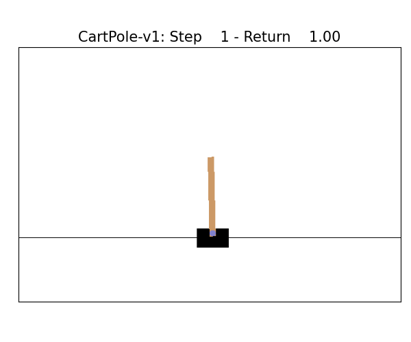

This folder contains training and visualization code related to Reinforcement Learning. Checkpoints are also provided. Gif's illustrate the actions of the trained agents.

## Notebooks available

The cartpole_ppo.ipynb notebook trains an agent to control CartPole-v1. Here is a Google Colab [version](https://colab.research.google.com/drive/1de8B3yS-VxfjxI1yj8b2phGge9mP0HuO?usp=sharing).
The cartpole_visual.ipynb loads the trained agent from a checkpoint and produces the following animation
. Here is a Google Colab [version](https://colab.research.google.com/drive/1de8B3yS-VxfjxI1yj8b2phGge9mP0HuO?usp=sharing).

